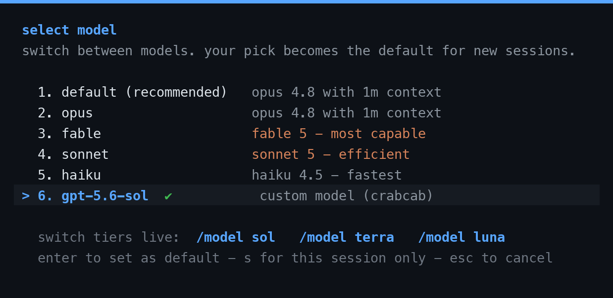

<p align="center">
  
</p>

<h1 align="center">crabcab</h1>

<p align="center"><em>the crab, in a cab</em></p>

<p align="center">
  
  
  
  
</p>

run claude code (same interface, same tools, same workflow you already know) just powered by an openai gpt model like `gpt-5.6-sol`, off your own chatgpt sub instead of anthropic's billing.

started from a tibo ([@thsottiaux](https://x.com/thsottiaux)) + theo ([@theo](https://x.com/theo)) tweet: keep the claude code cli you like, just point it at a codex/gpt model. so thats basically what this is. small, local, one file you can actually sit down and read.

## how it works

claude code has one knob you can override: `ANTHROPIC_BASE_URL`. point that at crabcab (a little local proxy, one file of plain python) and it sits in the middle translating claude code's messages api into openai's responses api and back, reusing the login codex already saved on your machine. your interface, their model, your sub.

## why its chill (safe)

- no dependencies. pure python standard library + your system `curl`. nothing to install, nothing extra you gotta trust.
- local only. binds to `127.0.0.1`, never touches the network, and turns away browser-driven requests (dns-rebinding/csrf).
- locked to you. it makes a per-machine secret (`~/crabcab/.secret`, `0600`) and wants it on every request, so nobody else on the box can ride your subscription.
- your token stays put. your codex oauth token gets read from `~/.codex/auth.json` at runtime (kept `0600`), never printed, never logged, and only ever goes to openai's own auth + codex endpoints. the optional reset-watcher makes *unauthenticated* calls to openai status and a couple public trackers (theyre listed down in [see also](#see-also)), it never sends your token to any of them.
- readable. one file of plain python, zero third party deps, you can read the whole thing top to bottom. do that honestly.

## good to know (please read)

this is a personal, diy, learn-by-building kind of tool. its **not** affiliated with or endorsed by openai or anthropic. it drives your chatgpt sub through an unofficial path (the same backend the real codex cli hits), so:

- treat it as a personal thing for your own account only.
- it might go against the terms of whatever service you point it at, and could get your account rate-limited or flagged. thats your risk to take.
- use at your own risk, no warranty (see the [license](LICENSE)). its not doing anything sneaky, it just speaks codex's api for you, but running it is your call.

## verify (optional)

every release ships a `SHA256SUMS` and a signature (`SHA256SUMS.sig`; the key's in `RELEASE-PUBLIC-KEY.txt`, not a personal one). check your copy is exactly what got published:

```sh
shasum -a 256 -c SHA256SUMS
printf 'crabcab-release %s\n' "$(cut -d' ' -f1-2 RELEASE-PUBLIC-KEY.txt)" > allowed_signers
ssh-keygen -Y verify -f allowed_signers -I crabcab-release -n file -s SHA256SUMS.sig < SHA256SUMS
```

a signature just proves the release wasnt swapped out under you. it does not prove the code is safe. i went through it with model help, not an independent human audit, so read every line yourself and pin an exact tag instead of a moving branch. want a bigger blast radius boundary? run it under a dedicated throwaway account. find a bug? open a private security advisory on github.

## setup

you'll need the codex cli installed and signed into chatgpt. thats the login crabcab borrows.

1. check your machine: `python3 scripts/doctor.py`
2. copy `scripts/proxy.py` to `~/crabcab/proxy.py`
3. test it offline: `python3 scripts/selftest.py` (you want `all green`)
4. add the `claudex` launcher to your shell (full steps in [SKILL.md](SKILL.md))
5. run `claudex`

switch tiers live from inside claude with `/model sol`, `/model terra`, or `/model luna` (whatever you pick sticks as your default), or just launch one straight up with `claudex terra`. your active tier shows in the `/model` picker:



## goodies

- **quota + bank.** `crabcab-usage` shows how much chatgpt juice you got left and how many banked resets are sitting there. it hard strips your email and id so it only ever prints numbers.
- **switch tiers.** `/model sol|terra|luna` live inside claude (sticks as your default), or `claudex terra` / `luna` at launch. `crabcab-tier` tells you which tier actually answered, read off the wire, not whatever the model says about itself. hard default with `CRABCAB_MODEL`.
- **dial the effort.** `CRABCAB_EFFORT=high claudex` when you want it thinking harder, `low` for quick stuff. or just use the effort slider in the `/model` picker.
- **is it even running?** `crabcab-status` tells you if the proxy's up and what model its on. `crabcab-stop` kills it.
- **stale codex?** if a model whines that it needs a newer codex, `python3 scripts/update-codex.py` prints the exact update command for your setup and changes nothing on its own.
- **reset radar.** crabcab quietly keeps an eye on your quota + banked resets, and notices when tibo tweets a reset (any wording) or codex has an incident up on openai status. it only pipes up when theres actually news, never mid session.

## whats inside

| file | what it is |
|---|---|
| `scripts/proxy.py` | the bridge (anthropic to codex responses) |
| `scripts/selftest.py` | offline translation test |
| `scripts/doctor.py` | environment / prereq check |
| `scripts/usage.py` | your quota + banked resets at a glance |
| `scripts/reset-watch.py` | quiet quota/reset radar (runs at launch) |
| `scripts/update-codex.py` | checks if codex needs updating (recommends, never auto runs) |
| `SKILL.md` | full step by step setup playbook |
| `references/troubleshooting.md` | common fixes |

## see also

resets are event driven (incidents, milestones, tibo's mood), theres no schedule to predict.

the optional reset-watcher makes unauthenticated, read only requests to these third party hosts (and never sends your token to any of them):
- `status.openai.com`, openai's incident feed
- `nitter.net`, `nitter.poast.org`, public x/twitter mirrors, for catching a reset tweet from [@thsottiaux](https://x.com/thsottiaux)
- `hascodexratelimitreset.today`, `www.willcodexquotareset.com`, community reset trackers

kill the desktop notifications with `CRABCAB_NOTIFY=0`, or drop the fetches entirely by pulling the `reset-watch.py` line out of your launcher. another community tool worth knowing: [coding_agent_usage_tracker](https://github.com/Dicklesworthstone/coding_agent_usage_tracker).

## credits

tibo ([@thsottiaux](https://x.com/thsottiaux)) and theo ([@theo](https://x.com/theo)) for the idea. built as a readable local diy take on it.

## license

[MIT](LICENSE), do what you want, no warranty. see [good to know](#good-to-know-please-read) for the account risk caveat.
